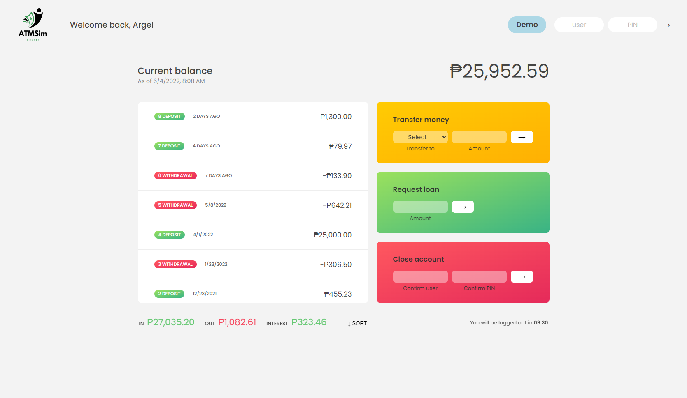

## Welcome! 👋

Thanks for checking out this mini project. ATMSim is a basic web application that simulates basic functions of an ATM machine. Note that all transactions you will make will not persist after reloading the webpage. This application only demonstrates my knowledge on core Javascript concepts including but not limited to DOM events, Array methods, Numbers, Date, and Intl namespaces.

## The challenge

The main challenge here is building a solid logic to simulate basic operations like doing money transfers or a loan application (mock, instantaneous loan), displaying account information, a simple login validation, currency and date formatting according to user's locale, account deletion and idle timer,

## My solution

- The database I used is hardcoded.
- For money transfers, I mainly used Array.find() to identify the receiver account.
- For loans, it's mostly built with validations so that you can't have a negative loan amount and you can only enter the max amount according to 10% of user's max deposit.
- For displaying transactions, the Array.forEach() method was used for the rows of HTML.
- Login and account deletion was built with validations and Array.find() as well.
- Dates was built arround the Date namespace, taking advantage of Date().toISOString().
- Also used Intl namespace for currency and date formatting together with hardcoded user locales.
- Idle timer build with setInterval functions and some validations.

## Technologies used

- HTML - Used to create the index.html file
- CSS - Used to design the webpage
- JavaScript - For the web app's logic implementation
- VSCode - IDE I used to create the web app
- Git - For version control
- Netflify - Used to host this web app

## Preview

## Deployment

You may visit the deployed web app through the link below.

- [https://amiralles-atmsim.netlify.app/](https://amiralles-atmsim.netlify.app/)

## Footer

Thank you for taking the time in checking out this repository.

**Argel Miralles | Full Stack Web Developer** 
**SIC PARVIS MAGNA**☝
